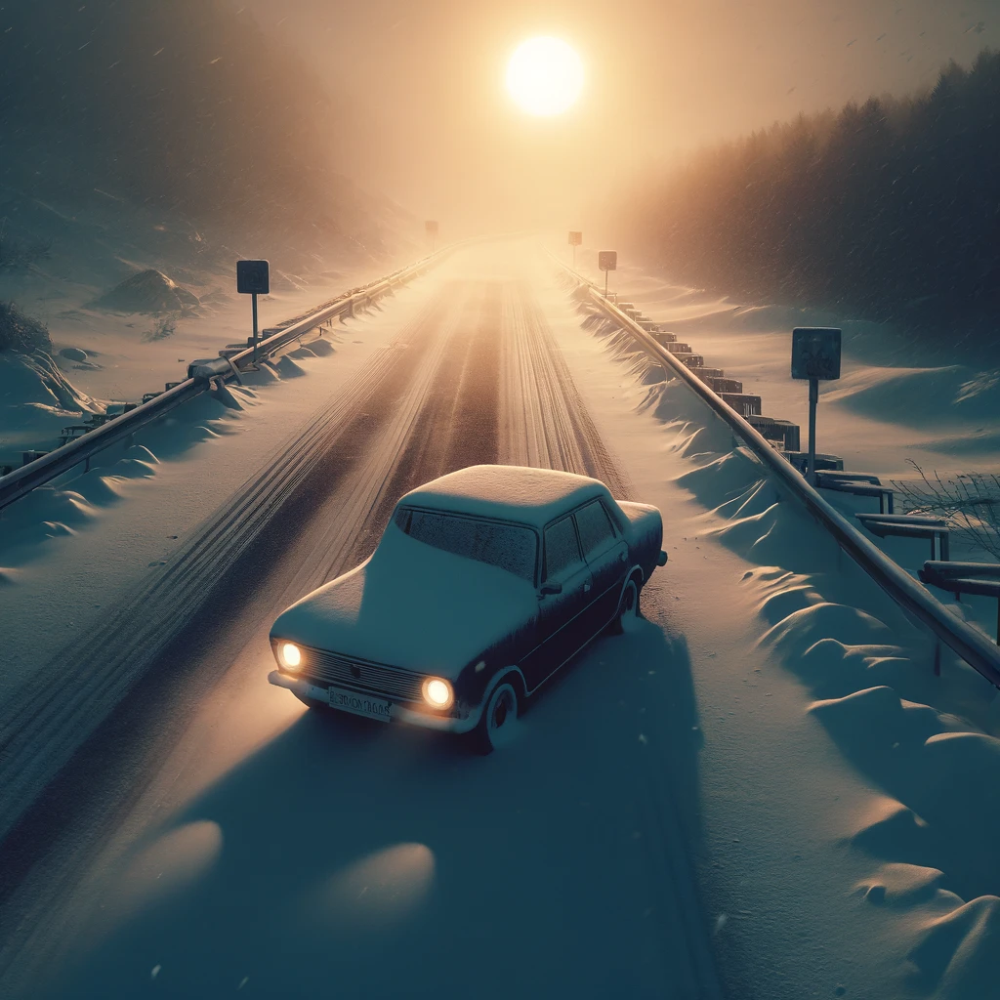

# The Ghibli's Highway

*Imagined 2024-04-10, transcribed by AI*

## Chapter 1: The Unplanned Departure

On a day that seemed ordinary, under the relentless sun, I found myself sitting by the roadside, parked in my car without a care in the world. The tranquility of the moment was shattered when a car pulled up beside me. A man, bearing an uncanny resemblance to Mr. Beast’s friend Chandler, hurried into my passenger seat, his urgency palpable. Without a word, I knew I had to drive away, and fast. As we fled the scene at a modest pace, I struck up a conversation, seeking answers about our sudden departure.

The man revealed we were on a drug run, a revelation that sent chills down my spine. I hastily made it clear that I wanted no part in this. As I glanced at him, he was rolling a cannabis joint. Disapprovingly, I reached for a cigarette from an open pack and started smoking, attempting to calm my nerves. After a few puffs, he warned me about the potency of the smoke, especially for a first-timer. My vision stretched in two directions, and then darkness.

## Chapter 2: The Cold Awakening

I woke up in the snow beside the road, disoriented and alone. Instinctively, I knew the police were searching for the car we had abandoned. I decided to hide, but fate had other plans. A police car stopped to check on me. They didn’t question why I was there but asked everything else. I had no phone, just a wallet full of money. I tried to convince them to call me a taxi, but they doubted my ability to pay, treating me like a vagrant. After they left, I started walking back towards the village from where our flight had begun.

The journey back was quicker than expected. Once I reached civilization, I attempted to ask strangers to call a taxi for me, to no avail. Frustrated and feeling stuck, I decided to move on.

## Chapter 3: Unexpected Companions

As I wandered, asking for a ride, I met a few travelers who, like me, wished to leave. Our efforts to find someone willing to call a taxi were futile. With no other choice, I continued walking, eventually passing a bar where four attractive girls sat, to whom I offered a smile. The road led me to an indoor train station, surprisingly populated by children aged 8 to 12, and the bar girls were there too. We seemed to be the only adults, or at least from my perspective.

I bought a train ticket from a touchscreen device, but the train never came. We decided to proceed together.

## Chapter 4: The End of the Road

The journey led us to a depot, resembling a graveyard of abandoned vehicles and assorted junk. Here, we encountered beings responsible for this "highway prison." They claimed our lives for knowing too much, leaving us trapped in a world where reality blended with the surreal, a testament to the unpredictable journey of life and the consequences of the paths we choose.
