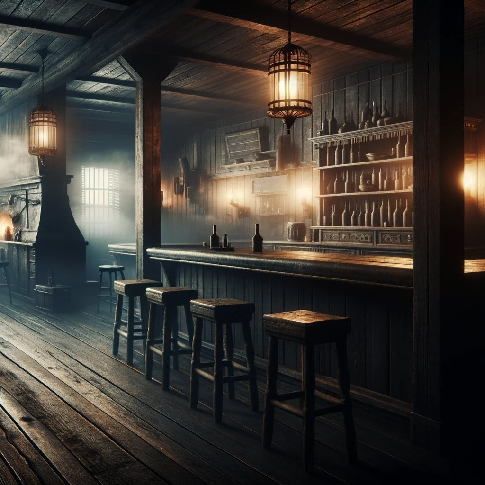

# The Phantom Island

*Imagined 2024-04-24, transcribed by AI, cared by me*

## Chapter 1: Unexpected Revelations

My partner and I were on a ferry, heading towards an island where we might stay overnight. As the waves rhythmically brushed against the ferry, my partner mentioned, "Did you know Pottukoira is planning to build a cabin here?" This trivia caught me off guard, and I responded with a surprised "No." The ferry docked, revealing a steep hill crowned with buildings, one of which was a particularly dilapidated house. The presence of human habitation surprised me as we climbed towards the settlements.

## Chapter 2: Ghost Stories and Decisions

As we ascended the hill, my partner casually dropped that the village was rumored to be haunted and suggested we could just tour around and leave on the same ferry. Reaching the top, I surveyed the surroundings — buildings reminiscent of the Wild West, largely in disrepair, hinting at the sparse local population. Despite their condition, there were plenty of accommodations aimed at tourists. We decided to explore the quaint, albeit rundown, village and even stopped by a cozy local store.

## Chapter 3: A Change of Plans

During our exploration, we discussed the possibility of not staying overnight due to the ghost stories. I admitted that I would prefer to leave since horror was not to my taste. As we headed back towards the dock to catch the ferry, we saw it pulling away from the island. Stranded, we reluctantly began searching for accommodations. We found multiple options along the hillside, with prices ranging from 5 to 50 markka, a Finnish currency no longer in use. Before I could make a decision, my girlfriend entered the most expensive establishment, making the choice for us. Following her inside, I thought to myself that perhaps the priciest option might offer us the best chance of enduring the night comfortably, especially if the place was indeed haunted.

## Chapter 4: Unsettling Welcome

Upon entering the inn, the first thing I noticed was the long bar counter to the right — a natural feature since the ground floor doubled as a bar and restaurant. I leaned against the counter next to my girlfriend, scanning the room which, at a glance, was very cozy and welcoming. The decor almost matched that of my favorite bar "Graali", complete with an indoor fireplace that added a homely touch.

Shortly, a customer service attendant appeared behind the counter. She was a short, slightly older than middle-aged woman, dressed only in a bathrobe with her shoulder-length hair in disarray, giving her a weary look. Her presence seemed to confirm the rumors of nocturnal happenings in the village. She scribbled something on a piece of paper, retrieved something from under the counter, and walked around to where we were standing. As she began to hand me something, she paused and looked into my eyes as if she'd seen something peculiar. The moment felt awkward, and I quickly demanded, "What is it?" She remained silent for a beat before responding, "I can't tell you just yet," while handing me the key to our room. At the same moment, she signalled to the bartender — who had also appeared behind the counter — to serve me a complimentary drink. The bartender promptly offered me a beer.

## Chapter 5: Ghostly Encounters Begin

As we settled at the bar, an old coworker appeared unexpectedly, accompanied by others from the same company, all in work attire. They mentioned that they were doing some basic construction on one of the estates on the island. After this encounter, things took a strange turn. My girlfriend disappeared, presumably upset and preferring to sleep separately, which only intensified my fears of the haunting. The former colleagues vanished as suddenly as they had appeared.

Now alone in the bar, the episode with the ghosts began. Sounds emerged from behind doors and paintings; a rocking horse moved by itself. I encountered human-like ghosts that could become invisible. After battling these phantoms (this was very confusing part), I went in search of my girlfriend and found her asleep (?) on a couch in the common lounge.

