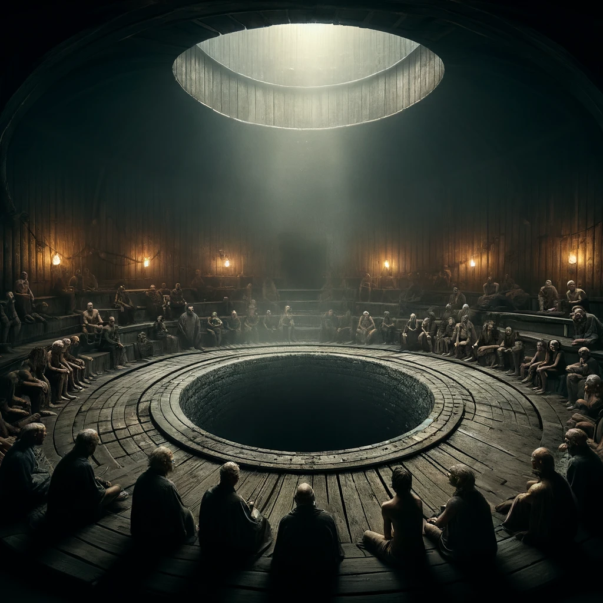

# The Serpent Sauna

*Imagined 2023-09-25, transcribed by AI*

## Chapter 1: Departure Preparations

In a secluded cabin village, nestled away from the prying eyes of civilization, we found ourselves preparing to leave. Our stay was brief but memorable, marked by a peculiar insistence on leaving no trace of our presence, an almost obsessive-compulsive desire for cleanliness and order. As we tidied up, ensuring not a sliver of the interior could be seen from the outside, you mentioned the outdoor toilet's tank needed emptying—a task neither of us was keen on due to its complex and frankly bizarre system.

Agreeing to divide our tasks, I stayed behind to finish up some minor chores around the cabin, while you ventured off to handle the tank. Curiosity got the better of me, and I decided to follow, hoping to learn how to manage this odd task for future reference.

## Chapter 2: The Dark Descent

My journey led me to a communal washroom and sauna area, cloaked in darkness. I navigated the dimly lit corridors, guided by the faint sound of water and an unsettling aura that grew stronger with every step. At the end of this labyrinthine path, I stumbled upon a vast, circular room that seemed to double as a sauna, with a large, ominous pit at its center.

Surrounding this pit was a gathering of individuals, their appearances worn and tired, bearing the marks of life’s harsher realities. They sat in silent anticipation, their eyes void of hope. As I watched from the doorway, heart racing with a mix of fear and fascination, the ritual began.

## Chapter 3: The Serpent Ritual

The tanks were dumped into the central pit, and those tasked with the emptying followed suit, descending into the darkness below. A heavy lid sealed their fate, and an eerie silence enveloped the room. After what seemed like an eternity, the lid was removed, revealing a sight beyond comprehension.

The humans who had entered the pit were no more, transformed instead into serpents, entwined in a deadly dance of survival. This horrifying spectacle unfolded as a twisted form of sacrifice, a perverse ritual to cleanse the human filth by converting it into a serpent’s strife.

## Chapter 4: The Escape

As the serpents battled, their hisses and thrashes echoing through the chamber, I realized the gruesome truth behind the village’s pristine condition. This was no simple sauna; it was a sacrificial ground, a place where human waste was exchanged for the purity of nature, albeit through a macabre and ancient rite.

Overwhelmed by horror and disbelief, I fled, the sounds of the serpent pit fading into the night. The serene beauty of the cabin village now masked an unspeakable darkness, a reminder of the lengths to which humanity will go to rid itself of its own corruption.

As I emerged from the shadow of the woods, the weight of what I had witnessed pressed heavily upon me. The cabin village, with its quaint charm and hidden horrors, would forever haunt my dreams, a chilling testament to the ancient and unspeakable rituals that lurk beneath the surface of seemingly peaceful retreats.
