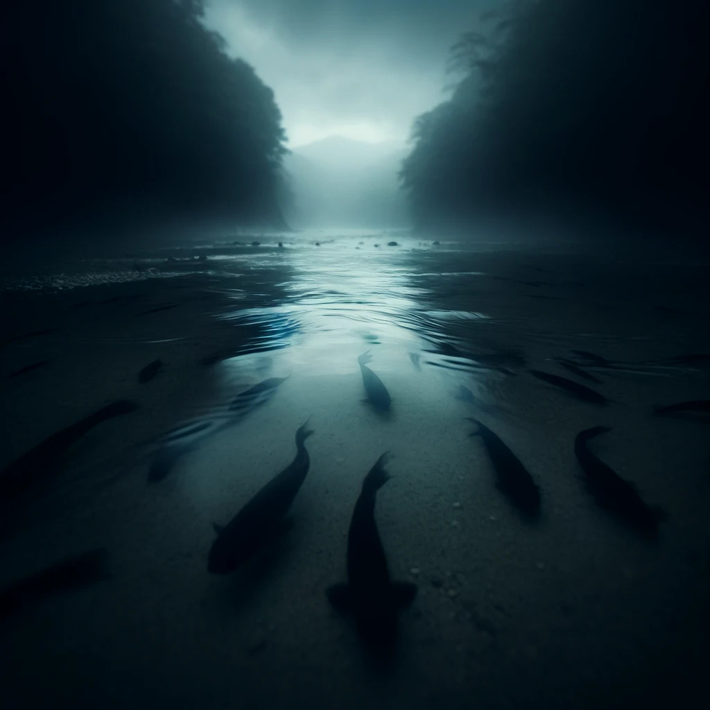

# The River of Souls

*Imagined 2024-04-23, transcribed by AI, cared by me*

## Chapter 1: The Mysterious Commute

It was just another day in a city that felt both familiar and alien. I walked with a determined stride, clutching a black crocodile-skin briefcase. Despite my familiarity with the city, today it seemed like a labyrinth, each turn revealing a new mystery. My pace quickened as if I were late for an unmissable appointment.

Crossing a bustling square, I encountered two women walking ahead of me, their pace leisurely and conversational, though their words soon escalated to an argument. As I edged past them, the anxiety of having others so close made me grip my briefcase tighter — the precious cargo it contained adding to my unease.

## Chapter 2: Confrontation and Escape

The sound of the women's bickering faded into the background as I moved on, passing groups of revelers whose drunken laughter filled the night. Just as I began to relax, my peace was shattered by a sudden and direct threat. A man emerged from the shadows, running towards me with a gun aimed directly at me. As he fired, I instinctively dropped to the ground, the briefcase falling beside me, its contents a burden I could no longer ignore.

Scrambling to my feet, I realized the assailant wasn’t just targeting anyone — he was after me. The gunfire resumed, this time aimed at a bystander who seemed to be approaching to help. With no time to think, I seized my briefcase and fled through the maze of unfamiliar streets, the sound of gunshots echoing behind me as my pursuer followed.

Desperate for an escape, I reached a waterfront where, to my relief and immediate suspicion, a boat was waiting. Driven by my survival instincts, I jumped aboard, only to realize as we pulled away that my flight had led me directly into another trap: the boat was under the control of the armed man. It was too late to turn back now.

## Chapter 3: The Unwitting Journey

As the boat sliced through the water, I realized too late that my supposed escape was actually a passage deeper into peril — I was aboard the gunman’s getaway boat. A tense conversation followed; they were reluctant to share details, but eventually, I learned we were headed to an island with a mountain. It was part of their escape plan, cleverly disguised as a regular trip.

The atmosphere on the boat was thick with tension. I did not fit into their plan and was treated more like a hostage. Upon reaching the island, we disembarked, and I was coerced into following them, still unsure of our exact destination.

## Chapter 4: Stream of Shadows

Our journey led to a low, flat stream flowing improbably uphill. Amidst the stream, shadows of koi fishes flitted about — an impossibility given the stream’s shallow depth. As I contemplated this anomaly, I realized I was alone. The group had vanished.

Compelled by an unseen force, I followed the stream, which gradually widened. More shadows appeared, including those resembling human footprints in the water. It dawned on me that this stream might be some mythical river, a river which is used by wandering souls to travel to an unknown destination.

## Chapter 5: Ascent and Revelation

Feeling like one woken up, drawn by an ancient wooden elevator, I ascended the mountain. At the summit, I encountered an altar dedicated to a deceased woman, adorned with her picture, flowers, and candles. A sense of terror filled me — I had been here before in another life, and something terrible was about to occur.

Before I could react, the vision became a reality: a mutilated body appeared before me. Stricken, I leapt from the mountain in a desperate bid to flee the nightmare.

